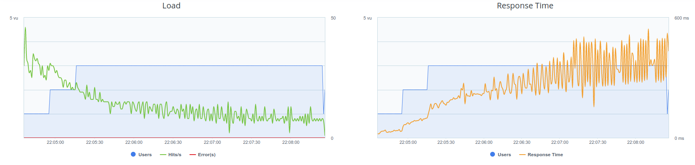
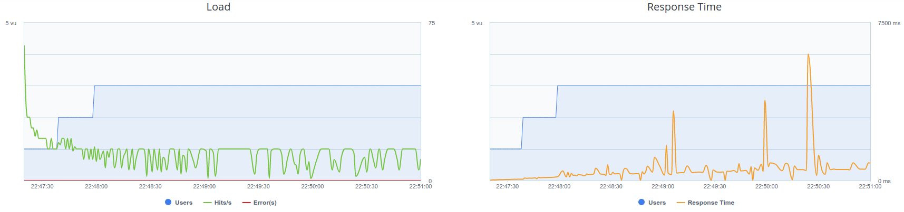

# Ília Back-End Python Developer Challenge
## Author: Lucca Garcia Leão

- [x] Enhance product service
- [x] Delete product rpc call
- [x] Wire into smoketest.sh
- [x] Wire into perf-test
- [x] Wire unit test for this method

Delete product was implemented and passing unit test was added in  ```products/test/test_dependencies.py```. Smoke test ```nex-smoketest.sh``` was modified to include delete requests. Perf-test now includes DELETE requests.

- [x] Enhance order rpc call
- [x] List orders rpc call
- [x] Wire into smoketest.sh
- [x] Wire into perf-test
- [x] Wire unit test for this method


List orders was implemented in order service ```/gateway/service.py``` and passing gateway unit tests were added in ```gateway/test/test_service.py```. The list orders rpc call was added to ```nex-smoketest.sh``` and perf-test.

- Question 1: Why is performance degrading as the test runs longer?
  - Answer: The ``get_order()``, ``list_orders()`` and ``create_orders()`` methods call the products rpc ``list()`` to get all the products to enhance the order. As the tests run longer, more orders are created and inserted in the database, which makes the list method response time longer. The following image shows the average response time achieved in the performance test with degrading performance:



- Question 2: How do you fix it?
  - Answer: The time complexity of ``list()`` is O(n). This is unnecessary, and a possible solution would be to implement a O(1) (best case scenario) method to get the products for each order.

(bonus) Fix it: To fix the performance issue, the calls to ``list()`` products in the mentioned methods were replaced with the ``get()`` method. This is possible because the product ID is known beforehand. With this information, it's possible to get the specific products in each order instead of always listing all products. This improved the performance tests results greatly, as can be seen in the following image:


